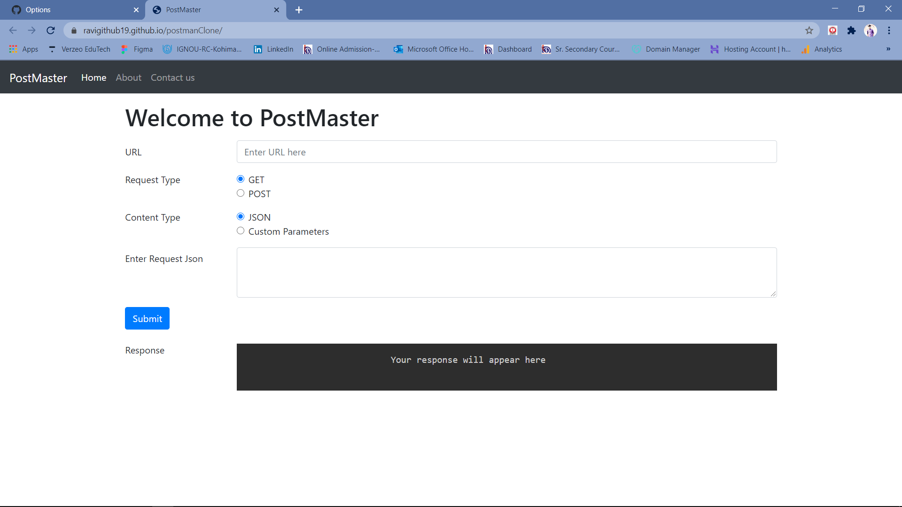
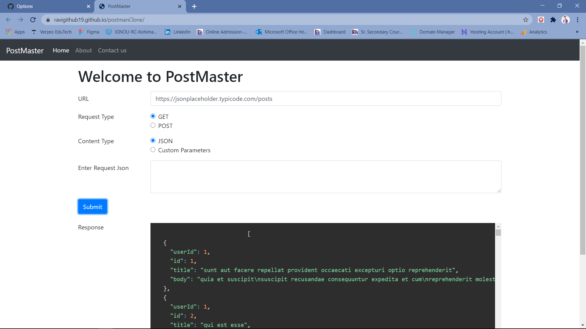
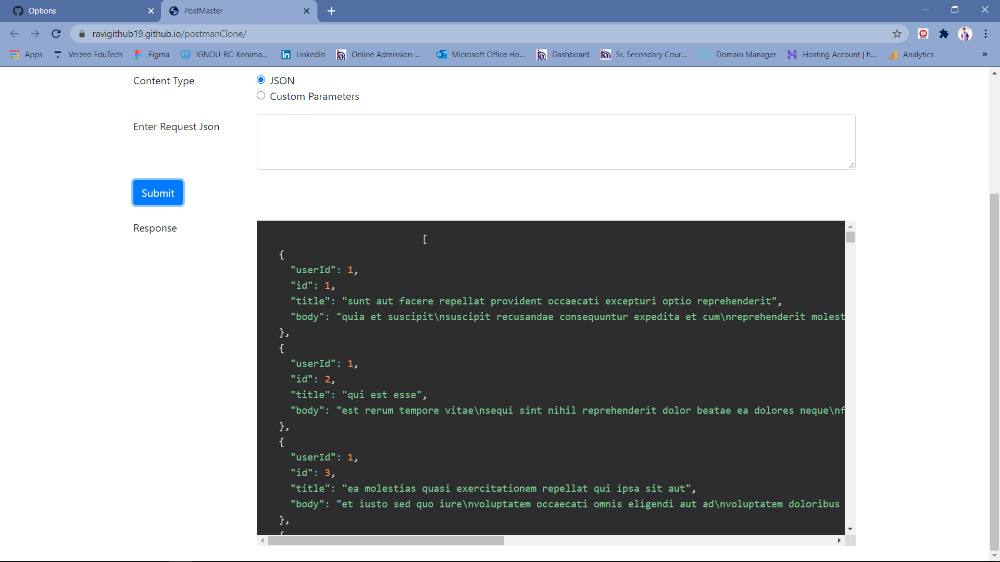
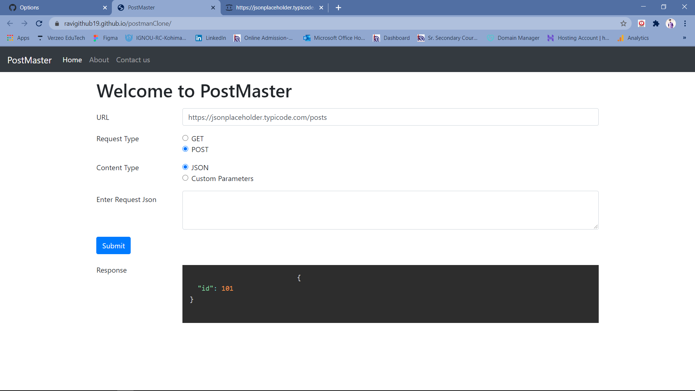

## View Live
> Postman - https://ravigithub19.github.io/MagicNotes/

## About
> Postman is currently one of the most popular tool for testing API's. I have worked on simple UI with the help of Bootstrap and made it interactive with the use of JavaScript to give an actual feel like Postman software.

>Focused on:

>Response Type - GET & POST
>Content Type - JSON & Custom Parameters

## Screenshots

 

 

 

 

## Technologies
* HTML5
* Bootstrap
* Javascript

## Status
> Completed
